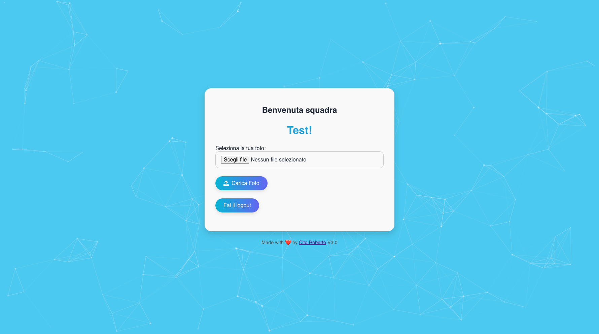
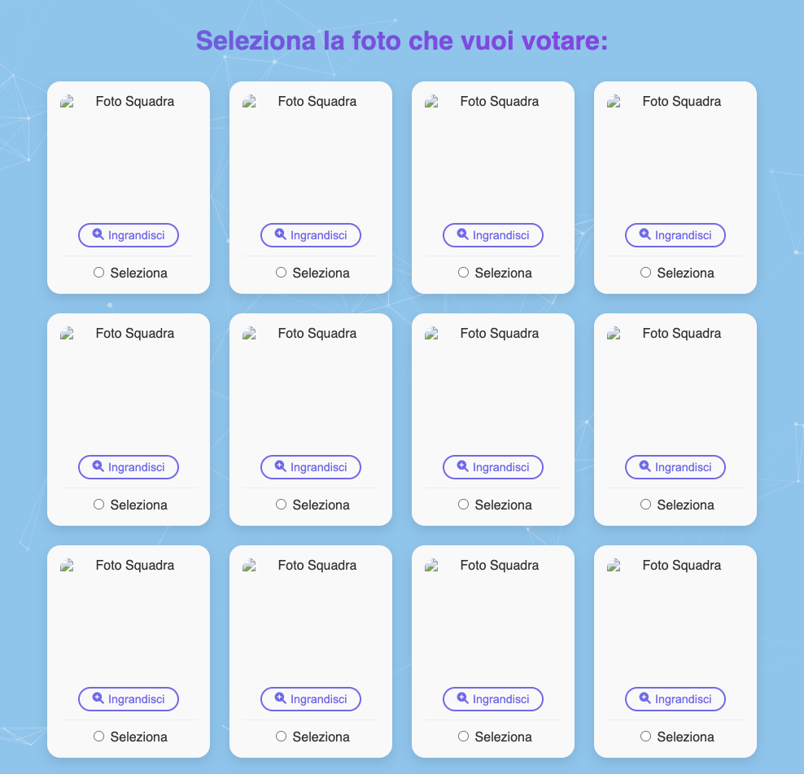
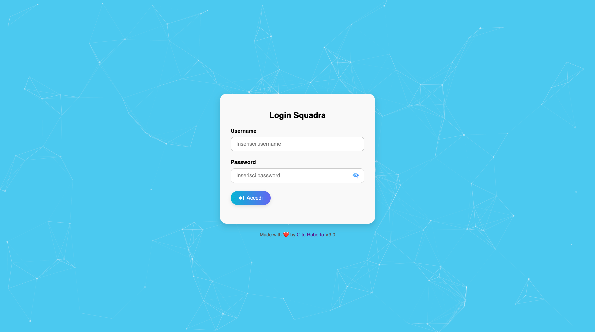
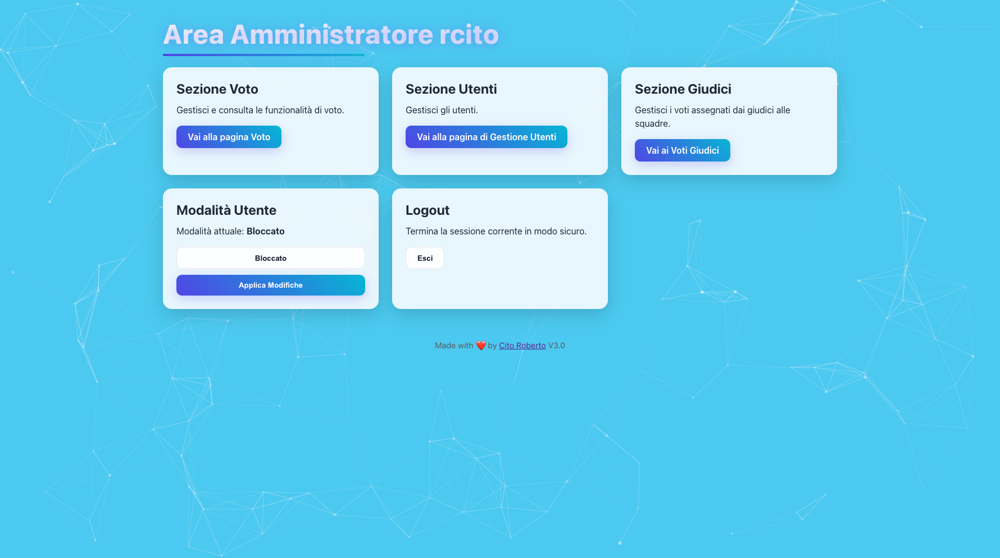
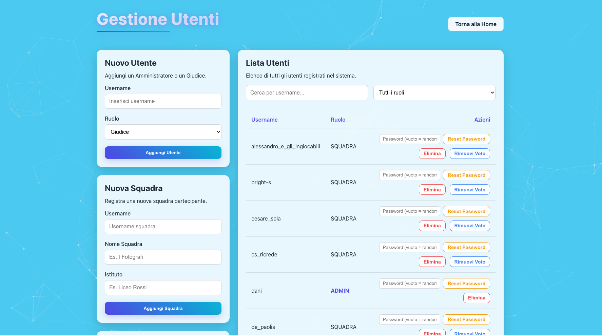
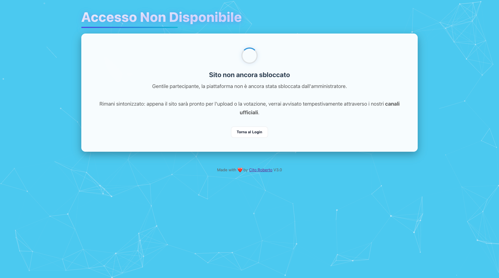
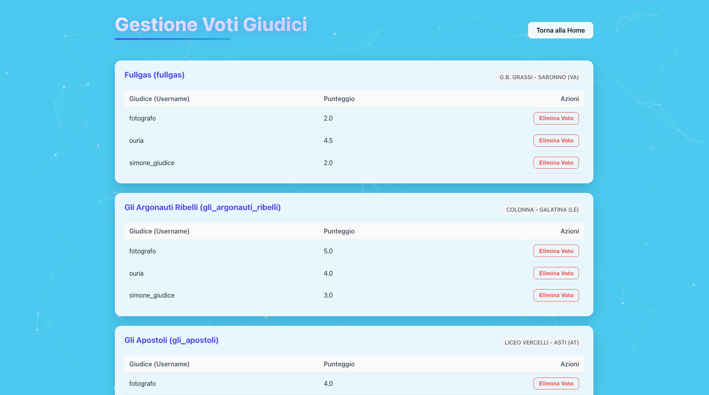
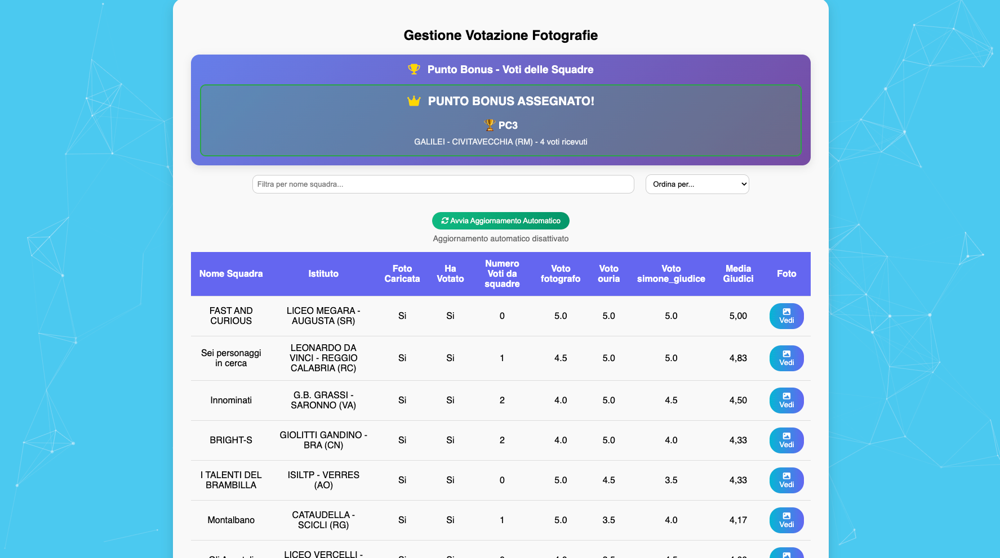
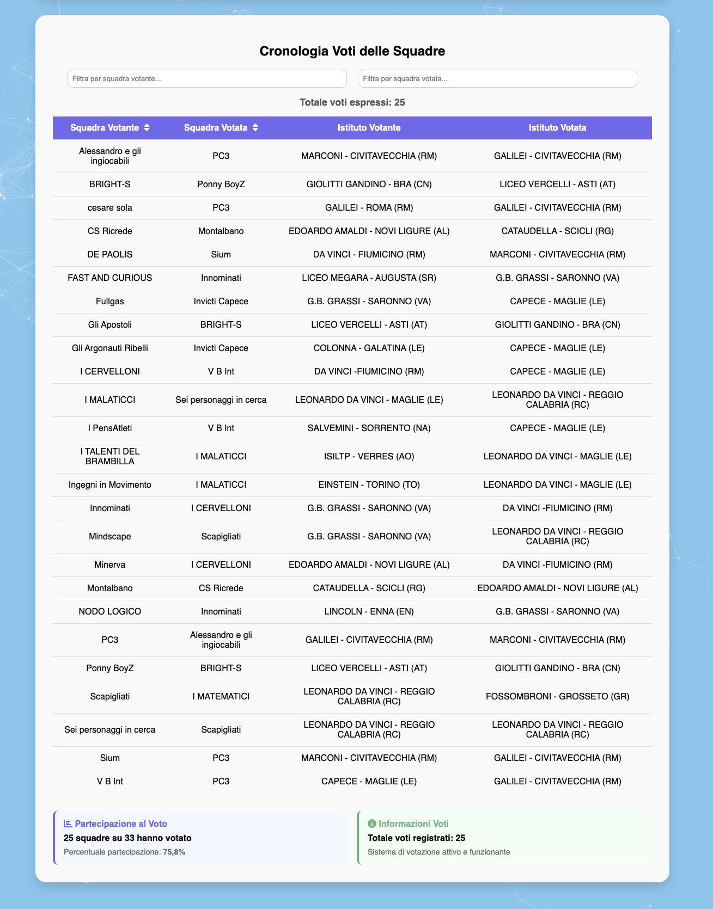

# 📸 Votazione Fotografica OCT


**Votazione Fotografica OCT** è l'applicazione web ufficiale sviluppata per la gestione e lo svolgimento della **Prova Fotografica** durante le finali delle **Olimpiadi della Cultura e del Talento (OCT)**.

Questa piattaforma offre un ambiente sicuro e strutturato in cui le squadre finaliste possono caricare i propri scatti e, in una fase successiva, votare le fotografie realizzate dalle squadre avversarie, nel pieno rispetto del regolamento della competizione.

> [!WARNING]
> **Copyright & Licenza:** Questo software è protetto da diritto d'autore (All Rights Reserved). Non è consentita la copia, distribuzione, modifica, o alcun uso commerciale o personale del codice senza esplicita autorizzazione.

> [!IMPORTANT]
> **Stato del Progetto:** L'applicazione è stata impiegata con successo durante le finali delle competizioni OCT, gestendo migliaia di interazioni in tempo reale e assicurando la massima correttezza delle votazioni.

---

#### 🔗 Link Utili
* **Sito Ufficiale OCT:** [olimpiadidellacultura.it](https://www.olimpiadidellacultura.it/)

---

#### 📑 Indice
*   [🏆 Il Ruolo dell'Applicazione](#-il-ruolo-dellapplicazione)
*   [⚖️ Regole di Votazione](#️-regole-di-votazione)
*   [👥 Sistema Multi-Ruolo](#-sistema-multi-ruolo)
*   [💻 Architettura e Tech Stack](#-architettura-e-tech-stack)
*   [🔌 Integrazione API (Servizio Esterno)](#-integrazione-api-servizio-esterno)
*   [⚙️ Pipeline CI/CD: Deploy e Testing](#️-pipeline-cicd-deploy-e-testing)
*   [☕ Sviluppo Locale con Docker](#-sviluppo-locale-con-docker)

---

#### 🏆 Il Ruolo dell'Applicazione

Durante i giorni delle finali, le squadre partecipanti sono chiamate a svolgere una **Prova Fotografica**, in cui devono immortalare un momento o un tema specifico e sottoporlo alla giuria, composta in questa fase dalle stesse squadre. 

L'applicazione funge da hub centrale per:
1. **Raccolta Materiale:** Le squadre accedono con le proprie credenziali per effettuare l'upload della fotografia in modo sicuro e tracciato.
   
   

2. **Esposizione:** Il sistema genera automaticamente una galleria in cui è possibile visionare le foto ammesse.
   
   

3. **Votazione Equa:** Ogni squadra ha la responsabilità di esprimere la propria preferenza, garantendo uno spoglio automatico e la generazione della classifica in tempo reale.

---

#### ⚖️ Regole di Votazione

Per assicurare che la gara sia completamente equa e priva di favoritismi, il sistema applica in modo rigoroso, a livello di backend, le seguenti restrizioni:
*   **Divieto di Auto-Voto:** Nessuna squadra può visualizzare o votare la propria fotografia.
*   **Filtro per Istituto:** Una squadra non può visualizzare e di conseguenza non può votare le fotografie caricate da altre squadre provenienti dallo **stesso istituto scolastico**. Il sistema nasconde queste opzioni per evitare voti "di coalizione".

---

#### 👥 Sistema Multi-Ruolo

L'applicazione è progettata con un robusto sistema di autenticazione e autorizzazione (gestito da Spring Security) che divide l'accesso in base ai ruoli.



**1. Ruolo Utente (Squadre / Studenti):**
*   Dashboard dedicata al caricamento della foto (con validazione del formato e del peso).
    
    

*   Sezione galleria e votazione in cui possono esprimere in maniera definita le proprie preferenze.
    
    

*   Impossibilità di modificare il voto una volta confermato, se non secondo le policy configurate.

**2. Ruolo Amministratore (Staff OCT):**
*   **Pannello di Controllo:** Visione completa di tutte le squadre registrate, dei loro caricamenti e dello stato dei voti.
    
    

*   **Gestione Fase Votazioni:** Gli admin possono aprire o chiudere le sessioni di upload e di voto con un semplice flag, modificando in tempo reale lo stato dell'app per tutti gli utenti connessi.
    
    
    

*   **Gestione Voti Giudici:** Pannello per la supervisione dei voti espressi dai giudici (se previsto dalla fase).
    
    

*   **Classifica Real-Time:** Accesso a una leaderboard in tempo reale che calcola il punteggio basato sui voti ricevuti da ciascuna foto.
    
    
    

*   **Export Dati:** Possibilità di esportare con un clic l'intera classifica in formato **CSV**, fondamentale per stilare i risultati finali dell'evento da parte della giuria o della direzione.

---

#### 💻 Architettura e Tech Stack

Il progetto è una robusta applicazione monolitica sviluppata nell'ecosistema Java e ottimizzata per carichi di lavoro in produzione (Kubernetes):

*   **[Java 17 & Spring Boot (3.x)](https://spring.io/projects/spring-boot):** Il cuore dell'applicazione. Sfruttato per l'integrazione rapida di moduli, API e dipendenze.
*   **Spring Data JPA & Hibernate:** ORM utilizzato per gestire e modellare le complesse relazioni su database.
*   **Spring Security:** Per la protezione delle rotte, gestione delle sessioni, cifratura delle password e controlli basati sui ruoli (Admin vs Squadre).
*   **[Thymeleaf](https://www.thymeleaf.org/):** Motore di templating server-side integrato con Spring Security per renderizzare la UI dinamicamente, incluse le viste condizionali per l'admin.
*   **[MySQL 8.0](https://www.mysql.com/):** Database relazionale per il salvataggio persistente e transazionale degli utenti, dei log di voto e dei percorsi dei file.
*   **[Docker & Kubernetes](https://kubernetes.io/):** Progettata nativamente per essere eseguita in container su un cluster K8s, assicurando scalabilità e affidabilità.

---

#### 🔌 Integrazione API (Servizio Esterno)

Per permettere l'interoperabilità con il **sistema di Votazione completo** (un altro microservizio dell'ecosistema OCT), è stata esposta un'apposita API protetta da chiave (API Key).

*   **Endpoint:** `GET /admin/getclassifica`
*   **Autenticazione:** Richiede un parametro `apicode` in querystring contenente la chiave segreta (condivisa tra i servizi). Questa rotta bypassa le restrizioni di sessione per le chiamate server-to-server.
*   **Risposta:** Ritorna l'intera classifica calcolata in tempo reale in formato JSON (lista delle squadre con i rispettivi voti, media e punteggi).

Questa integrazione consente al sistema centrale di aggregare i punteggi della *Prova Fotografica* con quelli delle altre prove della finale, senza alcun intervento manuale dello staff.

**Testing dell'API:**
All'interno della cartella `testAPI` è fornito uno script Python (`script.py`) utilizzato per simulare le richieste del server remoto e testare l'handshake. Sostituendo la costante `API_CODE` con la chiave corretta, è possibile testare la ricezione e la decodifica del JSON o, viceversa, verificare la robustezza del sistema in caso di chiave errata (errore 400).

---

#### ⚙️ Pipeline CI/CD: Deploy e Testing

> [!NOTE]
> **Scopo Portfolio:** La pipeline CI/CD (`.github/workflows/all-tests.yml`) descritta e configurata in questo repository pubblico esegue **esclusivamente la suite di testing automatizzata**. I job responsabili della build Docker e del deploy remoto su Kubernetes sono stati disabilitati intenzionalmente, in quanto questo repository funge da vetrina del codice sorgente.

Nel suo ambiente di origine, l'applicazione beneficiava di un flusso DevOps continuo:
1. **Automated Testing:** Ogni commit scatena una batteria di test completa su un runner isolato (incluse prove con testcontainers/mysql reali). 
   * Vengono testati Entità (Model), Endpoints (Controller), logiche di salvataggio/voto (RunningTest) ed E2E (SeleniumTest).
2. **Dockerization (Disabilitato qui):** Generazione dell'immagine sicura e spinta su Docker Hub.
3. **K8s Deploy (Disabilitato qui):** Approvvigionamento delle credenziali tramite GitHub Secrets ed esecuzione immediata del rolling update sul nodo di produzione.

---

#### ☕ Sviluppo Locale con Docker

Il metodo raccomandato per avviare il database e/o l'intero stack in locale è utilizzare **Docker Compose**, o sfruttare direttamente l'ambiente di sviluppo IDE.

**Requisiti:**
*   [Java JDK 17](https://adoptium.net/) installato.
*   [Maven](https://maven.apache.org/) o l'uso del wrapper `./mvnw`.
*   [Docker Desktop](https://www.docker.com/products/docker-desktop/) (opzionale per l'intera app, obbligatorio se si vuole il MySQL in un container rapido).

**Avvio Rapido (Solo DB):**
Se vuoi avviare l'app da IntelliJ o Eclipse, tira su il database con:
```bash
docker run --name oct-mysql -e MYSQL_ROOT_PASSWORD=root -e MYSQL_DATABASE=fotografia -p 3306:3306 -d mysql:8.0
```

E successivamente lancia l'applicazione Spring Boot:
```bash
./mvnw spring-boot:run
```
L'applicazione risponderà all'indirizzo `http://localhost:8080`.
